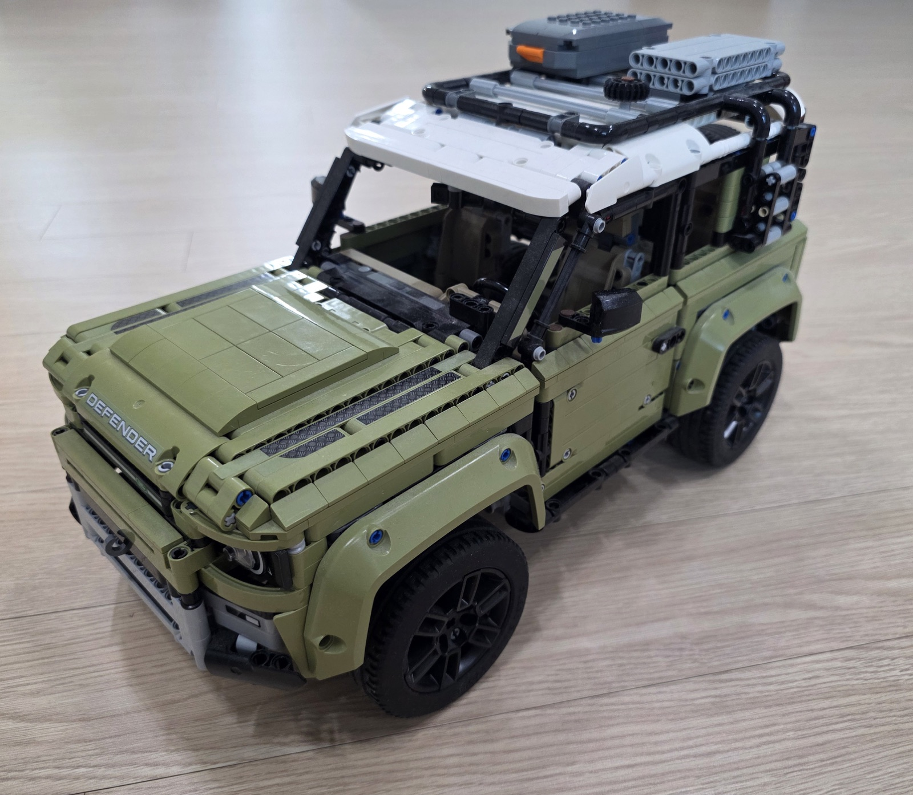

# Three.js Sculpt DNA

Turn an object reference image into a quality-gated, action-ready procedural Three.js model, then expand that model into a deterministic family of constraint-safe variants.

This GitHub Copilot CLI plugin is based on Vinh Hiển's MIT-licensed [Three.js Object Sculptor](https://github.com/vinhhien112/Three.js-Object-Sculptor-Codex-Plugin). It preserves the original image assessment, sculpt specification, pass locking, procedural PBR, action-ready hierarchy, and visual review workflow while porting the package to Copilot's `plugin.json` format.

Our original capability is **Sculpt DNA**: a semantic parameter layer that varies proportions, material response, palette, and repetition systems without changing component identity, attachment roots, sockets, fracture groups, or quality gates.

## What It Produces

- An image suitability verdict with explicit uncertainty.
- A pre-spec complexity assessment and object-specific quality contract.
- An `ObjectSculptSpec` describing geometry, materials, evidence, hierarchy, pivots, sockets, colliders, and destruction intent.
- A pass-gated TypeScript Three.js factory with generated PBR maps and look-dev lighting.
- Reference/render comparison sheets and structured AI-vision review history.
- Deterministic Sculpt DNA variant specs with mutation provenance and semantic invariant checks.

It is a code-native reconstruction workflow, not photogrammetry or exact mesh extraction.

## Canonical Repolis Tree Reference


The project now uses the owner-provided Gemini image above as its canonical reconstruction example. The earlier search-sourced dark tree image is not distributed in this repository.

The target is the luminous central tree, not the surrounding village. Its suitability is **conditional**: the silhouette and procedural decomposition are strong, but a single scene illustration cannot reveal exact rear branch topology or physically separate baked bloom from material response.

| Gate | Score (0–3) |
| --- | ---: |
| Object isolation | 1 |
| Silhouette readability | 3 |
| Depth inference | 2 |
| Primitive decomposition | 3 |
| Material procedurality | 3 |
| Occlusion risk | 2 |
| Interaction fit | 3 |

The committed example starts over from this reference with:

- 3 macro masses and 10 meso trunk, branch, root, and energy components
- warm bark, gold energy, amber leaf, and cyan leaf materials
- deterministic amber/cyan leaves, constellation nodes, and hanging lights
- separate bark and emissive channels so shaded wood does not collapse to black
- 12 safe material and repetition Sculpt DNA controls with semantic invariants; geometry controls stay disabled until their pivots, sockets, and colliders have explicit coupled updates

Files:

- `examples/repolis-tree/assessment.json`
- `examples/repolis-tree/object-sculpt-spec.json`
- `examples/repolis-tree/createRepolisTreeModel.ts`

### Hard-Surface Validation Reference



The user-provided vehicle photo replaces the inherited tower-ship artwork as the repository's hard-surface validation image. It exercises object isolation, front/side depth inference, panel hierarchy, repeated fasteners, wheel systems, roof attachments, and multi-material reconstruction. The inherited tower-ship image is used only for local migration checks and is not distributed in this repository.

### Seoul Scene Challenge


The Seoul photo is intentionally a difficult scene rather than an isolated object. It validates that the plugin does not blindly turn a whole photograph into one mesh: reflections in the sky, palace architecture, roads, vehicles, trees, urban blocks, and mountain silhouettes require the agent to reject a monolithic reconstruction and ask the user to select a specific target or accept a layered scene approximation.

Both user photos are stored as web-sized JPEGs with GPS, device, and original capture metadata removed.

## Original Sculpt DNA Idea

A single reconstructed object is useful; a reusable asset family is more valuable. Sculpt DNA turns carefully selected spec fields into named controls such as:

- body width, height, depth, taper, or bevel radius
- appendage length or radius while preserving the attachment root
- repetition count or density
- material roughness and surface age
- dominant procedural palette choices

Each parameter has a range or choice set, sampling distribution, semantic purpose, and optional coupling group. Constraints reject invalid combinations. Built-in invariants prevent variants from changing the model's semantic topology:

- component IDs and parent links
- material IDs and component material references
- socket IDs and fracture groups
- attachment parent/root sockets and `localStart`
- build-pass order and feature-review target IDs
- repetition-system IDs

Every generated variant receives a reproducible seed and mutation log. Existing screenshots and pass approvals are cleared because changed geometry or materials must earn fresh visual acceptance.

## Architecture

```text
reference image
    |
    v
technical probe -> pre-spec assessment -> ObjectSculptSpec
                                          |
                       +------------------+------------------+
                       |                                     |
                       v                                     v
             locked sculpt passes                    Sculpt DNA schema
                       |                                     |
                       v                                     v
             TypeScript factory                     deterministic variants
                       |                                     |
                       +------------------+------------------+
                                          |
                                          v
                         browser render + comparison sheet
                                          |
                                          v
                          AI-vision quality/feature review
```

## Technology Analysis

| Layer | Technology | Why it is used |
| --- | --- | --- |
| Copilot packaging | Root `plugin.json`, skill directories, `SKILL.md` YAML frontmatter | Native GitHub Copilot CLI plugin discovery and task-triggered instructions |
| Agent workflow | Markdown skills and focused reference documents | Keeps visual reasoning, quality gates, and implementation policy readable and editable |
| Data contract | Versioned JSON `ObjectSculptSpec` | Separates observed design intent from generated renderer objects and supports iterative correction |
| Automation | Python 3.10+ standard library | Portable CLIs with no mandatory package installation |
| CLI surface | `argparse`, `pathlib`, `json` | Predictable file-oriented commands and machine-readable output |
| Image probing | Binary header parsing with `struct` | Reads PNG, JPEG, GIF, WebP, and BMP dimensions without Pillow |
| PNG/PBR processing | `zlib`, `struct`, `math`, custom RGB/RGBA PNG reader/writer | Generates albedo, roughness, height, normal, and AO evidence without Python image dependencies |
| Non-PNG fallback | macOS `sips`, detected with `shutil.which` | Converts source images when direct PNG decoding is unavailable; other platforms should provide RGB/RGBA PNG input |
| Three.js generation | Python source generator emitting TypeScript | Produces plain Three.js factories that can be hand-refined in an existing application |
| Geometry | `BoxGeometry`, `SphereGeometry`, `CylinderGeometry`, `ConeGeometry`, `CapsuleGeometry`, `TorusGeometry`, attachment endpoint cylinders | Covers blockout primitives and root-to-tip child construction while leaving complex procedural shapes explicit |
| Materials | `MeshPhysicalMaterial`, emissive controls, deterministic Canvas textures, independent PBR channels | Keeps bark readable beneath glow, avoids flat-color placeholders, and prevents albedo reuse across unrelated PBR channels |
| Runtime structure | `THREE.Group` pivots plus `userData.sculptRuntime` maps | Keeps nodes, meshes, sockets, collider proxies, and destruction groups addressable for animation and physics |
| Visual QA | Browser screenshots, custom comparison sheets, semantic feature gates | Makes visual evidence—not code inspection—the acceptance authority |
| Variant engine | `copy`, SHA-256 seed derivation, `random.Random`, rejection sampling | Creates reproducible variants and retries samples until constraints pass |
| Verification | `unittest`, `tempfile`, `subprocess`, `compileall` | Tests both Python APIs and end-to-end CLI/factory generation without third-party test tools |

### Dependency Model

The plugin itself has no required PyPI or npm dependencies. Python scripts operate on JSON and images; generated TypeScript expects the target application to already depend on `three`.

The browser, TypeScript compiler, bundler, and Three.js version belong to the target project. The plugin intentionally does not install Playwright or Chromium solely for screenshots.

## Inherited Workflow, Script by Script

| Script | Responsibility |
| --- | --- |
| `probe_reference_image.py` | Detect image format, dimensions, aspect ratio, and basic technical risks |
| `new_pre_spec_assessment.py` | Create a complexity assessment and minimum quality contract |
| `new_sculpt_spec.py` | Create the versioned `ObjectSculptSpec` skeleton |
| `validate_sculpt_spec.py` | Validate structure, references, quality depth, action readiness, PBR intent, pass state, and Sculpt DNA |
| `sculpt_pass_orchestrator.py` | Lock deeper passes until prior visual evidence and reviews succeed |
| `generate_threejs_factory.py` | Emit the unlocked TypeScript Three.js factory and look-dev lights |
| `extract_reference_pbr.py` | Infer reference-derived PBR evidence and enforce a confidence threshold |
| `make_visual_comparison_sheet.py` | Package reference and render into one AI-reviewable PNG |
| `visual_feature_gate.py` | Enforce critical and important semantic feature thresholds |
| `append_sculpt_review.py` | Record AI-vision scores, mismatches, evidence, and correction decisions |
| `sculpt_dna.py` | Initialize, validate, and generate deterministic constraint-safe variants |
| `sculpt_dna_core.py` | Shared DNA schema, target resolver, constraints, invariants, sampling, and provenance |

## Requirements

- GitHub Copilot CLI with plugin support.
- Python 3.10 or newer.
- A Three.js browser project for generated model implementation.
- A rendered screenshot and AI-vision review for visual acceptance.

For non-PNG source images on platforms without macOS `sips`, convert the input to an RGB/RGBA PNG before PBR extraction or comparison-sheet generation.

## Install

Install from this local checkout:

```bash
copilot plugin install "$(pwd)"
copilot plugin list
```

Install from the private GitHub repository with authenticated `gh` cloning:

```bash
mkdir -p "$HOME/plugins"
gh repo clone hyeonsangjeon/Three.js-Object-Sculptor-github-Copilot-Plugin \
  "$HOME/plugins/threejs-sculpt-dna"
copilot plugin install "$HOME/plugins/threejs-sculpt-dna"
```

Direct `copilot plugin install OWNER/REPO` currently performs an unauthenticated clone for private repositories, so use the authenticated local-clone flow above.

Start a new Copilot CLI session, then verify the skills:

```text
/skills list
```

Copilot caches installed plugins. Reinstall the local path after modifying the plugin:

```bash
copilot plugin install "$(pwd)"
```

See GitHub's [plugin authoring guide](https://docs.github.com/en/copilot/how-tos/copilot-cli/customize-copilot/plugins-creating) and [CLI plugin reference](https://docs.github.com/en/copilot/reference/copilot-cli-reference/cli-plugin-reference).

## Base Reconstruction Quick Start

Probe the image:

```bash
python3 scripts/probe_reference_image.py ./reference/object.png
```

Create an assessment and spec:

```bash
python3 scripts/new_pre_spec_assessment.py "Reference Object" \
  --image ./reference/object.png \
  --complexity moderate \
  --out assessment.json

python3 scripts/new_sculpt_spec.py "Reference Object" \
  --image ./reference/object.png \
  --assessment assessment.json \
  --out object-sculpt-spec.json
```

Complete the observed fields and quality contract, then validate:

```bash
python3 scripts/validate_sculpt_spec.py object-sculpt-spec.json
python3 scripts/validate_sculpt_spec.py object-sculpt-spec.json --strict-quality
```

Check the unlocked pass and generate its factory:

```bash
python3 scripts/sculpt_pass_orchestrator.py status object-sculpt-spec.json
python3 scripts/generate_threejs_factory.py object-sculpt-spec.json \
  --out src/createReferenceObjectModel.ts
```

Render the model, capture a screenshot, and create the review artifact:

```bash
python3 scripts/make_visual_comparison_sheet.py \
  --reference ./reference/object.png \
  --render ./screenshots/object-render.png \
  --out ./screenshots/object-comparison.png \
  --json
```

After AI-vision review, record the pass:

```bash
python3 scripts/append_sculpt_review.py object-sculpt-spec.json \
  --pass-id blockout \
  --fidelity 0.82 \
  --action continue \
  --summary "Silhouette and primary proportions meet the blockout gate." \
  --render-screenshot ./screenshots/object-render.png \
  --comparison-image ./screenshots/object-comparison.png \
  --ai-vision-score 0.82 \
  --layer-scores-json '{"silhouetteProportion":0.84,"componentStructure":0.81,"formDetail":0.76,"materialSurface":0.72,"lightingCamera":0.8}' \
  --feature-reviews-json ./reviews/blockout-features.json \
  --ai-vision-notes "Primary shape passes; meso detail remains deferred." \
  --in-place
```

## Sculpt DNA Quick Start

Initialize conservative starter controls:

```bash
python3 scripts/sculpt_dna.py init object-sculpt-spec.json --in-place
```

Edit `sculptDNA.parameters` into object-specific controls, then validate both layers:

```bash
python3 scripts/sculpt_dna.py validate object-sculpt-spec.json
python3 scripts/validate_sculpt_spec.py object-sculpt-spec.json
```

Generate eight reproducible variants:

```bash
python3 scripts/sculpt_dna.py generate object-sculpt-spec.json \
  --out-dir ./variants \
  --count 8 \
  --seed 1337
```

The output directory contains:

```text
variants/
├── <target-id>-v001.json
├── <target-id>-v002.json
├── ...
└── sculpt-dna-manifest.json
```

Each variant can enter the normal pass-gated factory and screenshot workflow:

```bash
python3 scripts/validate_sculpt_spec.py variants/<target-id>-v001.json
python3 scripts/generate_threejs_factory.py variants/<target-id>-v001.json \
  --out src/createSelectedVariantModel.ts
```

## Quality Gates

The workflow blocks progress when:

- the reference does not expose enough silhouette or depth information
- the quality contract is too generic for the object
- component hierarchy or attachment contracts are too shallow
- material response is flat, aliased across PBR channels, or unsupported by source evidence
- a future build pass is requested before the current pass receives visual approval
- the global visual score is acceptable but a critical semantic feature fails
- Sculpt DNA targets protected semantic fields
- a variant violates declared constraints or invariants

## Project Layout

```text
plugin.json
skills/
├── object-to-threejs-procedural/
│   ├── SKILL.md
│   └── references/
└── sculpt-dna-variants/
    ├── SKILL.md
    └── references/
scripts/
├── sculpt_dna.py
├── sculpt_dna_core.py
└── ...
examples/
└── repolis-tree/
    ├── assessment.json
    ├── object-sculpt-spec.json
    └── createRepolisTreeModel.ts
tests/
└── test_sculpt_dna.py
```

## Test

```bash
python3 -m compileall -q scripts tests
python3 -m unittest discover -s tests -v
```

The test suite covers DNA derivation, schema validation, immutable-target rejection, deterministic generation, evidence reset, manifest output, generated TypeScript metadata, release-image dimensions, file-size budgets, EXIF removal, and inherited-asset exclusion.

## Limitations

- One image cannot reveal exact hidden geometry or manufacturing dimensions.
- PBR extraction is evidence-driven inference, not exact inverse rendering.
- Transparent glass, smoke, liquids, fur, and fine cloth may require more references or a reduced target.
- Complex generated primitives such as lathe, tube, curve sweep, extrude, and instanced clusters still require object-specific hand refinement.
- Variant constraints protect declared semantics, but visual acceptance still requires fresh browser evidence.

## License and Provenance

MIT. The original 2026 Vinh Hiển copyright and permission notice are preserved in `LICENSE`.

This fork adds the GitHub Copilot CLI manifest and terminology, Sculpt DNA skills and schema, deterministic variant generation, semantic invariants, variant provenance, generated runtime metadata, tests, and updated documentation.
