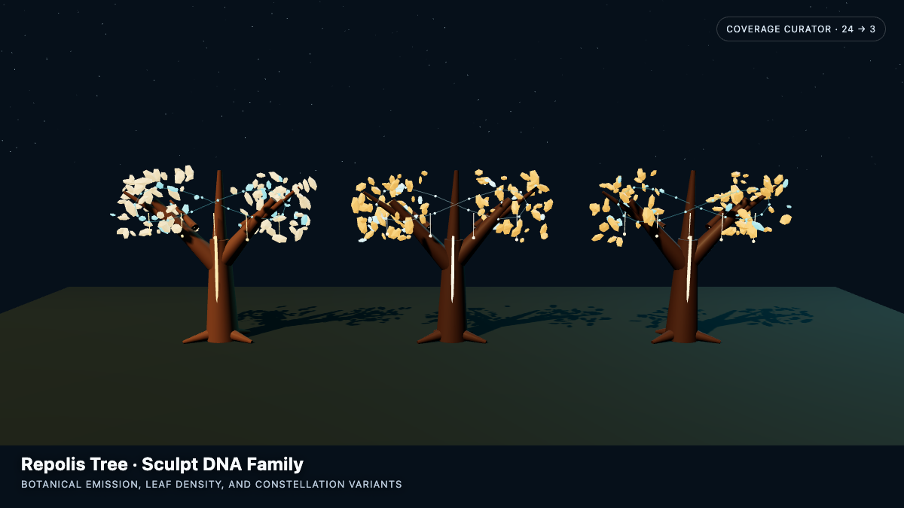
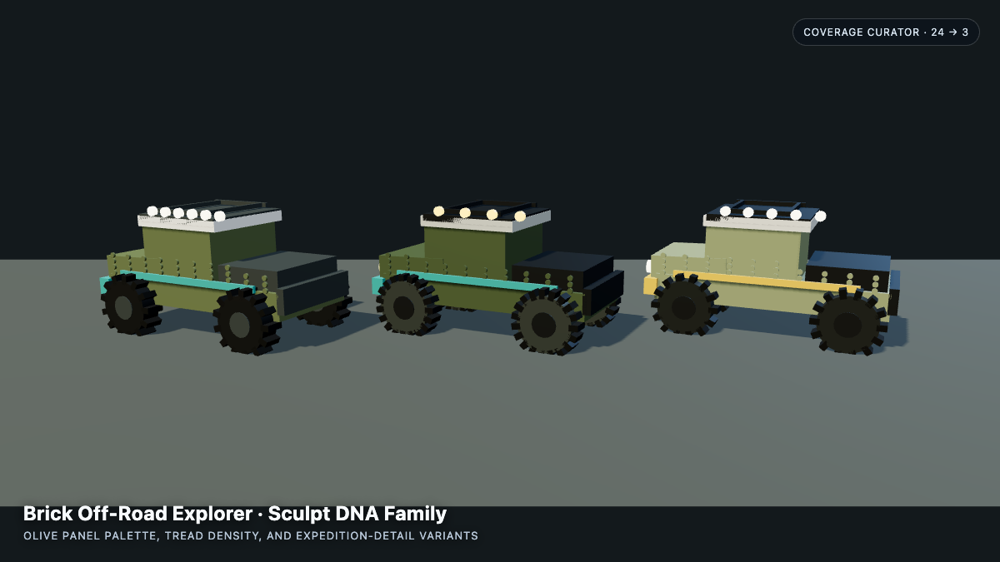
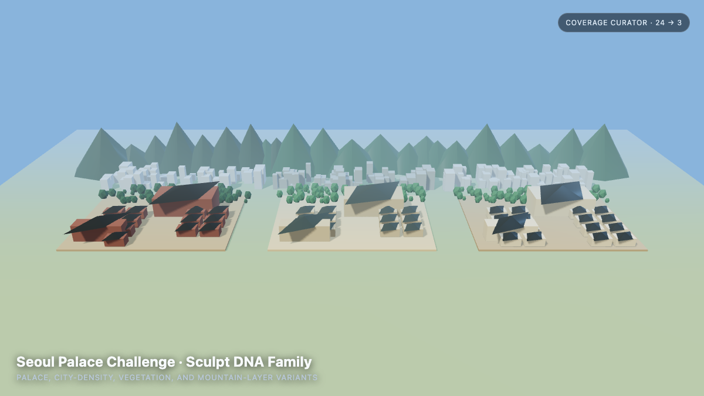

# threejs-sculpt-dna — A GitHub Copilot Plugin

> A community-built GitHub Copilot plugin for code-native procedural Three.js reconstruction and deterministic asset families.

Turn an object reference image into a quality-gated, action-ready procedural Three.js model, then expand that model into a deterministic family of constraint-safe variants.

This GitHub Copilot plugin is based on Vinh Hiển's MIT-licensed [Three.js Object Sculptor](https://github.com/vinhhien112/Three.js-Object-Sculptor-Codex-Plugin). It preserves the original image assessment, sculpt specification, pass locking, procedural PBR, action-ready hierarchy, and visual review workflow while porting the package to Copilot's `plugin.json` format.

Our original capability is **Sculpt DNA**: a semantic parameter layer that varies proportions, material response, palette, and repetition systems without changing component identity, attachment roots, sockets, fracture groups, or quality gates.

Its **Coverage Curator** generates a larger safe candidate pool and uses a deterministic centroid-extreme plus greedy max-min heuristic to select a broadly separated representative family. This prevents README contact sheets, product families, and art-direction reviews from showing three nearly identical random samples without claiming an expensive global combinatorial optimum.

## 03 · Flagship: Repolis Living Archive

[Open the interactive Repolis Tree demo](https://hyeonsangjeon.github.io/threejs-sculpt-dna/)


The final flagship is generated entirely with code: **0 imported meshes**, approximately **100ms generation**, **17,761 branch vertices**, **2,600 instanced leaves**, **220 moss instances**, and **72 branch-following code glyphs** in the Golden Canopy configuration.


The interactive page imports the same reusable output intended for the Repolis application:

- [Repolis production factory](examples/repolis-hero/repolis-output/createRepolisHero.js)
- [TypeScript declarations](examples/repolis-hero/repolis-output/createRepolisHero.d.ts)
- [Runtime profile](examples/repolis-hero/repolis-output/repolis-hero-profile.json)
- [Pass-by-pass visual evidence](examples/repolis-hero/evidence/)

## How It Was Built

**01 Reference** → **02 Sculpt DNA variants** → **03 Flagship above**

<table>
  <tr>
    <th>01 · Reference</th>
    <th>02 · Sculpt DNA variants — intermediate</th>
    <th>03 · Flagship — final</th>
  </tr>
  <tr>
    <td></td>
    <td></td>
    <td></td>
  </tr>
</table>

The reference establishes the identity contract: monumental Y-shaped trunk, gold energy network, amber/cyan canopy, constellation ornaments, and a luminous night landmark.

The middle contact sheet is design-space exploration, not the finished asset. Coverage Curator generated 24 constraint-safe candidates and selected three broadly separated variants while preserving component IDs, parent links, sockets, attachment roots, and review targets. The flagship above then received object-specific geometry, PBR, lighting, camera, interaction, optimization, and eight evidence-backed sculpt-pass reviews.

[Evidence-backed base spec](examples/repolis-tree/object-sculpt-spec.json) ·
[Coverage Curator manifest](examples/showcase/variants/tree/sculpt-dna-manifest.json) ·
[Variant renderer](examples/showcase/showcase.js)

## Quick Start

1. Register the marketplace and install the plugin:

   ```bash
   copilot plugin marketplace add \
     hyeonsangjeon/threejs-sculpt-dna

   copilot plugin install \
     threejs-sculpt-dna@threejs-copilot-plugins
   ```

2. Start a new GitHub Copilot session and verify `/skills list` includes:
   - `object-to-threejs-procedural`
   - `sculpt-dna-variants`

3. Attach a reference image and ask Copilot to reconstruct it:

   ```text
   Use Three.js Sculpt DNA for GitHub Copilot.

   Reconstruct this attached reference as a browser-real-time, action-ready
   procedural Three.js model. Follow the locked sculpt passes, review browser
   screenshots, then curate 3 representative variants from 24 safe candidates.
   Do not use an imported mesh.
   ```


Read the [complete user guide](docs/USER_GUIDE.md) for production vs preview variants, prompt templates, updates, uninstalling, and troubleshooting.

## Additional Demo Families

Brick and Seoul remain explicit preview families. Every generated variant resets its own visual evidence before promotion.

### Brick Off-Road Explorer

<table>
  <tr>
    <th>Reference</th>
    <th>Sculpt DNA variants</th>
  </tr>
  <tr>
    <td></td>
    <td></td>
  </tr>
</table>

This hard-surface study preserves the raised four-wheel topology, olive body panels, light roof, cabin and hood hierarchy, tire treads, roof rack, lamps, and recovery accents while varying bounded material and repetition parameters.

[Base spec](examples/brick-offroad/object-sculpt-spec.json) ·
[Variant manifest](examples/showcase/variants/brick/sculpt-dna-manifest.json) ·
[Renderer](examples/showcase/showcase.js)

### Seoul Palace Scene Challenge

<table>
  <tr>
    <th>Reference crop</th>
    <th>Sculpt DNA variants</th>
  </tr>
  <tr>
    <td></td>
    <td></td>
  </tr>
</table>

This is deliberately a **conditional scene reconstruction**, not one isolated object. The workflow decomposes the crop into palace halls, dark roof rhythms, courtyard, tree belt, city blocks, and mountain ridges, then varies their density and palette while preserving front-to-back layer order.

[Base spec](examples/seoul-challenge/object-sculpt-spec.json) ·
[Variant manifest](examples/showcase/variants/seoul/sculpt-dna-manifest.json) ·
[Renderer](examples/showcase/showcase.js)

The two camera photos are stored as web-sized JPEGs with GPS, device, and original capture metadata removed.

Run the interactive showcase locally:

```bash
cd examples/showcase
npm install
npm run serve
```

Then open `http://127.0.0.1:4173/?scene=tree`, replacing `tree` with `brick` or `seoul`.

## At A Glance

- **Plugin:** `threejs-sculpt-dna`
- **Skills:** `object-to-threejs-procedural` and `sculpt-dna-variants`
- **Input:** an attached object image, reference screenshot, or local image path
- **Output:** a procedural Three.js factory, versioned `ObjectSculptSpec`, deterministic variant family, and visual review evidence
- **Best for:** real-time props, hard-surface objects, botanical landmarks, product studies, and explicitly layered scene approximations
- **Not for:** photogrammetry, exact mesh extraction, or guaranteed hidden-side reconstruction from one image

## What It Produces

- An image suitability verdict with explicit uncertainty.
- A pre-spec complexity assessment and object-specific quality contract.
- An `ObjectSculptSpec` describing geometry, materials, evidence, hierarchy, pivots, sockets, colliders, and destruction intent.
- A pass-gated TypeScript Three.js factory with generated PBR maps and look-dev lighting.
- Reference/render comparison sheets and structured AI-vision review history.
- Deterministic Sculpt DNA variant specs with mutation provenance and semantic invariant checks.
- Coverage-curated representative families selected from larger safe candidate pools.

It is a code-native reconstruction workflow, not photogrammetry or exact mesh extraction.

## Why High-Detail Results Take Multiple Passes

The skill is a disciplined construction workflow, not a one-click detail filter. High-detail procedural assets come from combining:

- custom curve-swept geometry with taper, bends, multi-frequency deformation, and enough radial/longitudinal segments for the hero silhouette
- hierarchical macro, secondary, tertiary, and fine components rather than one trunk or shell mesh
- deterministic instancing for leaves, studs, treads, moss, lights, trees, buildings, and other repeated systems
- independent albedo, roughness, height, normal, and AO channels plus object-specific local overrides
- small identity details such as branch collars, end grain, sockets, roof tiers, ground contacts, wear, and ornaments
- browser screenshot review and AI-vision correction after every locked sculpt pass
- batching, instancing, and LOD only after the visual identity has passed

The generated factory is therefore a pass-gated scaffold. Hero quality still requires object-specific form, material, lighting, and optimization work.

Our extension adds a second problem-solving layer: after those detailed assets define a safe semantic design space, **Coverage Curator** greedily broadens parameter-space coverage without changing topology, attachments, action-ready hierarchy, or visual review targets.

## Original Sculpt DNA Idea

A single reconstructed object is useful; a reusable asset family is more valuable. Sculpt DNA turns carefully selected spec fields into named controls such as:

- body width, height, depth, taper, or bevel radius
- appendage length or radius while preserving the attachment root
- repetition count or density
- material roughness and surface age
- dominant procedural palette choices

Each parameter has a range or choice set, sampling distribution, semantic purpose, and optional coupling group. Constraints reject invalid combinations. Built-in invariants prevent variants from changing the model's semantic topology:

- component IDs and parent links
- material IDs and component material references
- socket IDs and fracture groups
- attachment parent/root sockets and `localStart`
- build-pass order and feature-review target IDs
- repetition-system IDs

Every generated variant receives a reproducible seed and mutation log. Existing screenshots and pass approvals are cleared because changed geometry or materials must earn fresh visual acceptance.

For a representative family rather than a raw batch:

```bash
python3 scripts/sculpt_dna.py curate object-sculpt-spec.json \
  --out-dir curated \
  --count 3 \
  --pool-size 24 \
  --seed 1337
```

## Architecture

```text
reference image
    |
    v
technical probe -> pre-spec assessment -> ObjectSculptSpec
                                          |
                       +------------------+------------------+
                       |                                     |
                       v                                     v
             locked sculpt passes                    Sculpt DNA schema
                       |                                     |
                       v                                     v
             TypeScript factory                     deterministic variants
                       |                                     |
                       +------------------+------------------+
                                          |
                                          v
                         browser render + comparison sheet
                                          |
                                          v
                          AI-vision quality/feature review
```

## Technology Analysis

| Layer | Technology | Why it is used |
| --- | --- | --- |
| Copilot packaging | Root `plugin.json`, skill directories, `SKILL.md` YAML frontmatter | Native GitHub Copilot plugin discovery and task-triggered instructions |
| Agent workflow | Markdown skills and focused reference documents | Keeps visual reasoning, quality gates, and implementation policy readable and editable |
| Data contract | Versioned JSON `ObjectSculptSpec` | Separates observed design intent from generated renderer objects and supports iterative correction |
| Automation | Python 3.10+ standard library | Portable CLIs with no mandatory package installation |
| CLI surface | `argparse`, `pathlib`, `json` | Predictable file-oriented commands and machine-readable output |
| Image probing | Binary header parsing with `struct` | Reads PNG, JPEG, GIF, WebP, and BMP dimensions without Pillow |
| PNG/PBR processing | `zlib`, `struct`, `math`, custom RGB/RGBA PNG reader/writer | Generates albedo, roughness, height, normal, and AO evidence without Python image dependencies |
| Non-PNG fallback | macOS `sips`, detected with `shutil.which` | Converts source images when direct PNG decoding is unavailable; other platforms should provide RGB/RGBA PNG input |
| Three.js generation | Python source generator emitting TypeScript | Produces plain Three.js factories that can be hand-refined in an existing application |
| Geometry | `BoxGeometry`, `SphereGeometry`, `CylinderGeometry`, `ConeGeometry`, `CapsuleGeometry`, `TorusGeometry`, attachment endpoint cylinders | Covers blockout primitives and root-to-tip child construction while leaving complex procedural shapes explicit |
| Materials | `MeshPhysicalMaterial`, emissive controls, deterministic Canvas textures, independent PBR channels | Keeps bark readable beneath glow, avoids flat-color placeholders, and prevents albedo reuse across unrelated PBR channels |
| Runtime structure | `THREE.Group` pivots plus `userData.sculptRuntime` maps | Keeps nodes, meshes, sockets, collider proxies, and destruction groups addressable for animation and physics |
| Visual QA | Browser screenshots, custom comparison sheets, semantic feature gates | Makes visual evidence—not code inspection—the acceptance authority |
| Variant engine | `copy`, SHA-256 seed derivation, `random.Random`, rejection sampling | Creates reproducible variants and retries samples until constraints pass |
| Verification | `unittest`, `tempfile`, `subprocess`, `compileall` | Tests both Python APIs and end-to-end CLI/factory generation without third-party test tools |

### Dependency Model

The plugin itself has no required PyPI or npm dependencies. Python scripts operate on JSON and images; generated TypeScript expects the target application to already depend on `three`.

The browser, TypeScript compiler, bundler, and Three.js version belong to the target project. The plugin intentionally does not install Playwright or Chromium solely for screenshots.

## Inherited Workflow, Script by Script

| Script | Responsibility |
| --- | --- |
| `probe_reference_image.py` | Detect image format, dimensions, aspect ratio, and basic technical risks |
| `new_pre_spec_assessment.py` | Create a complexity assessment and minimum quality contract |
| `new_sculpt_spec.py` | Create the versioned `ObjectSculptSpec` skeleton |
| `validate_sculpt_spec.py` | Validate structure, references, quality depth, action readiness, PBR intent, pass state, and Sculpt DNA |
| `sculpt_pass_orchestrator.py` | Lock deeper passes until prior visual evidence and reviews succeed |
| `generate_threejs_factory.py` | Emit the unlocked TypeScript Three.js factory and look-dev lights |
| `extract_reference_pbr.py` | Infer reference-derived PBR evidence and enforce a confidence threshold |
| `make_visual_comparison_sheet.py` | Package reference and render into one AI-reviewable PNG |
| `visual_feature_gate.py` | Enforce critical and important semantic feature thresholds |
| `append_sculpt_review.py` | Record AI-vision scores, mismatches, evidence, and correction decisions |
| `sculpt_dna.py` | Initialize, validate, and generate deterministic constraint-safe variants |
| `sculpt_dna_core.py` | Shared DNA schema, target resolver, constraints, invariants, sampling, and provenance |

## Requirements

- GitHub Copilot with plugin support.
- Python 3.10 or newer.
- A Three.js browser project for generated model implementation.
- A rendered screenshot and AI-vision review for visual acceptance.

For non-PNG source images on platforms without macOS `sips`, convert the input to an RGB/RGBA PNG before PBR extraction or comparison-sheet generation.

## Install

Install from this local checkout:

```bash
copilot plugin install "$(pwd)"
copilot plugin list
```

Install directly from GitHub:

```bash
copilot plugin install hyeonsangjeon/threejs-sculpt-dna
```

Copilot currently warns that direct repository installs will eventually move to marketplace-only distribution, but the public repository install is supported today.

Install through this repository's Copilot plugin marketplace:

```bash
copilot plugin marketplace add \
  hyeonsangjeon/threejs-sculpt-dna

copilot plugin install \
  threejs-sculpt-dna@threejs-copilot-plugins
```

GitHub Copilot plugin marketplaces are decentralized repositories rather than a single approval-based catalog. The checked-in `.github/plugin/marketplace.json` makes this repository a supported marketplace source.

Start a new Copilot CLI session, then verify the skills:

```text
/skills list
```

Copilot caches installed plugins. Reinstall the local path after modifying the plugin:

```bash
copilot plugin install "$(pwd)"
```

See GitHub's [plugin authoring guide](https://docs.github.com/en/copilot/how-tos/copilot-cli/customize-copilot/plugins-creating) and [CLI plugin reference](https://docs.github.com/en/copilot/reference/copilot-cli-reference/cli-plugin-reference).

## Base Reconstruction Quick Start

Probe the image:

```bash
python3 scripts/probe_reference_image.py ./reference/object.png
```

Create an assessment and spec:

```bash
python3 scripts/new_pre_spec_assessment.py "Reference Object" \
  --image ./reference/object.png \
  --complexity moderate \
  --out assessment.json

python3 scripts/new_sculpt_spec.py "Reference Object" \
  --image ./reference/object.png \
  --assessment assessment.json \
  --out object-sculpt-spec.json
```

Complete the observed fields and quality contract, then validate:

```bash
python3 scripts/validate_sculpt_spec.py object-sculpt-spec.json
python3 scripts/validate_sculpt_spec.py object-sculpt-spec.json --strict-quality
```

Check the unlocked pass and generate its factory:

```bash
python3 scripts/sculpt_pass_orchestrator.py status object-sculpt-spec.json
python3 scripts/generate_threejs_factory.py object-sculpt-spec.json \
  --out src/createReferenceObjectModel.ts
```

Render the model, capture a screenshot, and create the review artifact:

```bash
python3 scripts/make_visual_comparison_sheet.py \
  --reference ./reference/object.png \
  --render ./screenshots/object-render.png \
  --out ./screenshots/object-comparison.png \
  --json
```

After AI-vision review, record the pass:

```bash
python3 scripts/append_sculpt_review.py object-sculpt-spec.json \
  --pass-id blockout \
  --fidelity 0.82 \
  --action continue \
  --summary "Silhouette and primary proportions meet the blockout gate." \
  --render-screenshot ./screenshots/object-render.png \
  --comparison-image ./screenshots/object-comparison.png \
  --ai-vision-score 0.82 \
  --layer-scores-json '{"silhouetteProportion":0.84,"componentStructure":0.81,"formDetail":0.76,"materialSurface":0.72,"lightingCamera":0.8}' \
  --feature-reviews-json ./reviews/blockout-features.json \
  --ai-vision-notes "Primary shape passes; meso detail remains deferred." \
  --in-place
```

Repeat the locked render, comparison, review, and pipeline-sync loop for `structural-pass`, `form-refinement`, `material-pass`, and `surface-pass`. Production Sculpt DNA generation intentionally remains blocked until evidence-backed `reviewHistory` completes that sequence.

## Sculpt DNA Quick Start

Initialize conservative starter controls:

```bash
python3 scripts/sculpt_dna.py init object-sculpt-spec.json --in-place
```

Edit `sculptDNA.parameters` into object-specific controls, then validate both layers:

```bash
python3 scripts/sculpt_dna.py validate object-sculpt-spec.json
python3 scripts/validate_sculpt_spec.py object-sculpt-spec.json
```

After the base sculpt has completed through `surface-pass`, generate eight production variants:

```bash
python3 scripts/sculpt_dna.py generate object-sculpt-spec.json \
  --out-dir ./variants \
  --count 8 \
  --seed 1337
```

For an early, explicitly non-promotable design-space contact sheet, add `--preview`. Preview provenance records the missing base passes and keeps every result blocked pending its own visual review:

```bash
python3 scripts/sculpt_dna.py curate object-sculpt-spec.json \
  --out-dir ./preview-variants \
  --count 3 \
  --pool-size 24 \
  --seed 1337 \
  --preview
```

The output directory contains:

```text
variants/
├── <target-id>-v001.json
├── <target-id>-v002.json
├── ...
└── sculpt-dna-manifest.json
```

Each variant can enter the normal pass-gated factory and screenshot workflow:

```bash
python3 scripts/validate_sculpt_spec.py variants/<target-id>-v001.json
python3 scripts/generate_threejs_factory.py variants/<target-id>-v001.json \
  --out src/createSelectedVariantModel.ts
```

## Quality Gates

The workflow blocks progress when:

- the reference does not expose enough silhouette or depth information
- the quality contract is too generic for the object
- component hierarchy or attachment contracts are too shallow
- material response is flat, aliased across PBR channels, or unsupported by source evidence
- a future build pass is requested before the current pass receives visual approval
- the global visual score is acceptable but a critical semantic feature fails
- Sculpt DNA targets protected semantic fields
- a variant violates declared constraints or invariants

## Project Layout

```text
plugin.json
skills/
├── object-to-threejs-procedural/
│   ├── SKILL.md
│   └── references/
└── sculpt-dna-variants/
    ├── SKILL.md
    └── references/
scripts/
├── sculpt_dna.py
├── sculpt_dna_core.py
└── ...
examples/
└── repolis-tree/
    ├── assessment.json
    ├── object-sculpt-spec.json
    └── createRepolisTreeModel.ts
tests/
└── test_sculpt_dna.py
```

## Test

```bash
python3 -m compileall -q scripts tests
python3 -m unittest discover -s tests -v
```

The test suite covers DNA derivation, schema validation, immutable-target rejection, deterministic generation, evidence reset, manifest output, generated TypeScript metadata, release-image dimensions, file-size budgets, EXIF removal, and inherited-asset exclusion.

## Limitations

- One image cannot reveal exact hidden geometry or manufacturing dimensions.
- PBR extraction is evidence-driven inference, not exact inverse rendering.
- Transparent glass, smoke, liquids, fur, and fine cloth may require more references or a reduced target.
- Complex generated primitives such as lathe, tube, curve sweep, extrude, and instanced clusters still require object-specific hand refinement.
- Variant constraints protect declared semantics, but visual acceptance still requires fresh browser evidence.

## License

MIT
