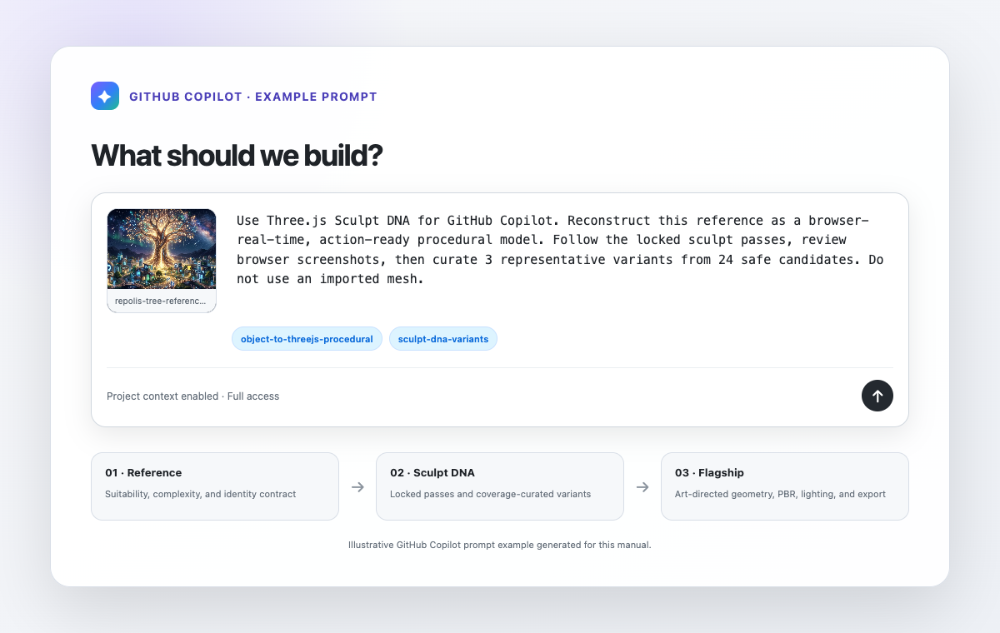

# Three.js Sculpt DNA for GitHub Copilot — User Guide

## 1. Install from the Copilot plugin marketplace

Register this repository as a marketplace:

```bash
copilot plugin marketplace add \
  hyeonsangjeon/Three.js-Object-Sculptor-github-Copilot-Plugin
```

Browse the registered plugin:

```bash
copilot plugin marketplace browse threejs-copilot-plugins
```

Install it:

```bash
copilot plugin install \
  threejs-sculpt-dna@threejs-copilot-plugins
```

Verify the installation:

```bash
copilot plugin list
```

Start a new Copilot session and check the available skills:

```text
/skills list
```

You should see:

- `object-to-threejs-procedural`
- `sculpt-dna-variants`

GitHub Copilot plugin marketplaces are decentralized Git repositories. The file `.github/plugin/marketplace.json` registers this repository as the `threejs-copilot-plugins` marketplace.

## 2. Attach a reference image

In GitHub Copilot:

1. Open the project where the Three.js output should be created.
2. Attach or drag an object reference image into the prompt.
3. Describe the intended use: browser prop, hero render, game object, articulated asset, or destructible object.
4. Ask Copilot to use the installed skills.



## 3. Recommended prompts

### Build one procedural object

```text
Use Three.js Sculpt DNA for GitHub Copilot.

Reconstruct the object in this attached image as a browser-real-time,
action-ready procedural Three.js model.

Follow the locked workflow:
reference validation -> complexity assessment -> ObjectSculptSpec ->
blockout -> structure -> form -> materials -> surface details ->
browser screenshots and AI-vision correction.

Keep stable pivots, sockets, colliders, and destruction groups.
Do not use an imported mesh.
```

### Generate a representative variant family

Use this only after the base sculpt has completed through `surface-pass`:

```text
Use sculpt-dna-variants on the completed ObjectSculptSpec.

Define bounded semantic controls, preserve all topology and action-ready
invariants, generate 24 safe deterministic candidates, and use Coverage
Curator to select 3 broadly separated variants.

Render every selected variant from the same camera and keep each one blocked
until it receives fresh visual review.
```

### Early design preview

```text
Create a non-promotable Sculpt DNA preview family from this strict spec.
Mark it as preview mode, list the missing base passes, and do not describe
the variants as production-ready.
```

### Flagship-quality result

```text
Choose the strongest curated variant and art-direct it as the flagship.

Increase object-specific curve geometry, hierarchy depth, generated PBR,
instanced detail, lighting, camera, interaction, and optimization quality.
Capture pass-by-pass evidence and save the reusable production factory
separately from the demo page.
```

## 4. What Copilot should do

The installed workflow should:

1. Reject or qualify unsuitable references.
2. Estimate complexity before implementation.
3. Decompose silhouette, structural components, materials, and surface details.
4. Build in locked passes instead of jumping directly to a polished mesh.
5. Compare browser renders with the reference and self-correct.
6. Preserve pivots, sockets, colliders, hierarchy, and destruction metadata.
7. Reset review evidence whenever a variant changes visible geometry or materials.
8. Use Coverage Curator for representative families instead of taking the first random samples.

## 5. Useful commands

Validate a spec:

```bash
python3 scripts/validate_sculpt_spec.py object-sculpt-spec.json --strict-quality
```

Check the active sculpt pass:

```bash
python3 scripts/sculpt_pass_orchestrator.py status object-sculpt-spec.json
```

Generate production variants after the evidence-backed base gate:

```bash
python3 scripts/sculpt_dna.py curate object-sculpt-spec.json \
  --out-dir variants \
  --count 3 \
  --pool-size 24 \
  --seed 1337
```

Generate an explicitly non-promotable preview:

```bash
python3 scripts/sculpt_dna.py curate object-sculpt-spec.json \
  --out-dir preview-variants \
  --count 3 \
  --pool-size 24 \
  --seed 1337 \
  --preview
```

## 6. Update or uninstall

Update:

```bash
copilot plugin update threejs-sculpt-dna
```

Uninstall:

```bash
copilot plugin uninstall threejs-sculpt-dna
```

Remove the marketplace:

```bash
copilot plugin marketplace remove threejs-copilot-plugins
```

Use `--force` only when you also want to uninstall plugins installed from that marketplace.

## 7. Troubleshooting

### Marketplace is already registered from another source

```bash
copilot plugin marketplace remove threejs-copilot-plugins --force
copilot plugin marketplace add \
  hyeonsangjeon/Three.js-Object-Sculptor-github-Copilot-Plugin
```

Then reinstall the plugin.

### Skills do not appear

Start a new Copilot session after installation and run `/skills list`.

### Production variant generation is blocked

This is intentional. Complete evidence-backed reviews through `surface-pass`, ensure the screenshot and comparison files still exist, then sync the pipeline:

```bash
python3 scripts/sculpt_pass_orchestrator.py sync object-sculpt-spec.json --in-place
```

### The reference is a crowded scene

Select one target object or explicitly accept a layered scene approximation. Do not claim exact hidden geometry from one image.

## Official documentation

- [Creating a plugin for GitHub Copilot](https://docs.github.com/en/copilot/how-tos/copilot-cli/customize-copilot/plugins-creating)
- [Creating a Copilot plugin marketplace](https://docs.github.com/en/copilot/how-tos/copilot-cli/customize-copilot/plugins-marketplace)
- [GitHub Copilot plugin reference](https://docs.github.com/en/copilot/reference/copilot-cli-reference/cli-plugin-reference)
